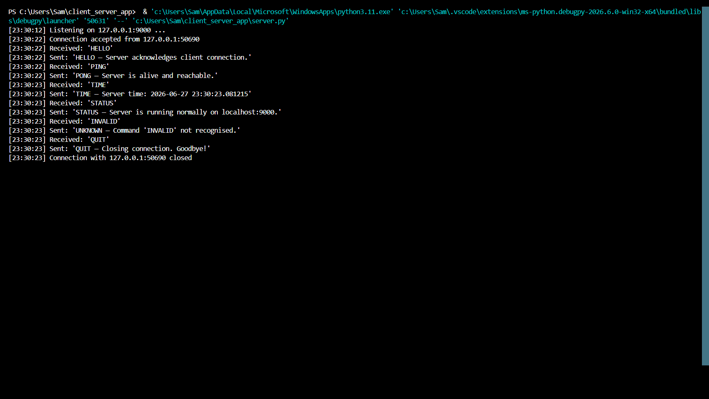
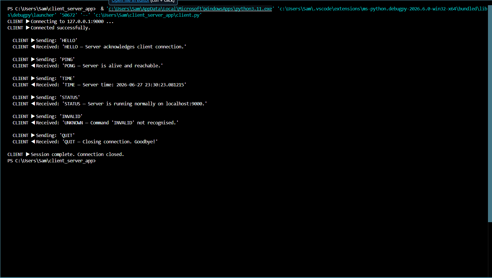

# Client-Server Application
**Distributed Systems Assignment | Kabarak University**

A simple TCP-based client-server application running on localhost, demonstrating core distributed systems communication principles — connection establishment, request-response messaging, layered architecture, and graceful session termination.

---

## Overview

| Item | Detail |
|---|---|
| Language | Python 3 |
| Protocol | TCP (socket.SOCK_STREAM) |
| Host | 127.0.0.1 (localhost) |
| Port | 9000 |
| Dependencies | None — Python stdlib only (socket, threading, datetime) |

---

## Files

```
client_server_app/
├── server.py   # TCP server — listens on port 9000, handles clients in threads
├── client.py   # TCP client — connects and sends command sequence
└── README.md
```

---

## How to Run

You need **two terminals** open at the same time.

**Terminal 1 — Start the server:**
```bash
python server.py
```

**Terminal 2 — Run the client:**
```bash
python client.py
```

The client will send 6 commands automatically and print every response. The server logs each event with a timestamp.

---

## Supported Commands

| Command | Server Response |
|---|---|
| `HELLO` | Acknowledges client connection |
| `PING` | Returns PONG — confirms server is alive |
| `TIME` | Returns current server timestamp |
| `STATUS` | Returns server status message |
| `INVALID` (or any unknown) | Returns error message with valid command list |
| `QUIT` | Closes the connection gracefully |

---

## Demo — Successful Communication

### Server Terminal


*Server starts, accepts connection, receives all 6 commands, sends responses, closes connection.*

### Client Terminal


*Client connects, sends each command, receives and prints the server's response.*

---

## Layered Architecture

```
┌─────────────────────────────────────────────┐
│  Application Layer  — Custom text protocol  │
│  (HELLO / PING / TIME / STATUS / QUIT)      │
├─────────────────────────────────────────────┤
│  Transport Layer    — TCP (SOCK_STREAM)      │
│  Reliable, ordered, error-checked delivery  │
├─────────────────────────────────────────────┤
│  Network Layer      — IPv4 (127.0.0.1)      │
│  Loopback — stays within the local machine  │
├─────────────────────────────────────────────┤
│  Data Link/Physical — OS loopback (lo)      │
│  No physical NIC required                   │
└─────────────────────────────────────────────┘
```

---

## Key Features

- **Multi-threaded server** — spawns a new daemon thread per client connection
- **Graceful termination** — QUIT command cleanly closes the socket on both sides
- **Error handling** — unknown commands return a helpful error message
- **Timestamped logging** — every server event is logged with HH:MM:SS timestamp
- **Zero dependencies** — runs on any machine with Python 3 installed
